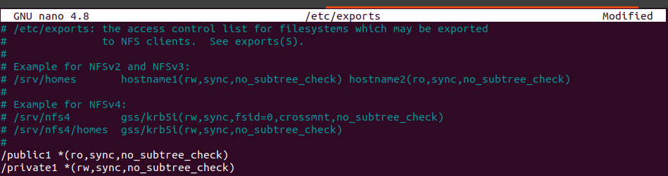

# Setup an NFS Server
## Table of Content
* Setup an NFS Server
    * Table of content
    * Hardware Requirements
    * Software Specifications
    * How to Install NFS Kernel Server
    * How to Create Root NFS Directory
    * Define Access for NFS Clients in Export File
    * How to Make NFS share Available to Clients
    * Configure NFS
    * Setting Up NFS on Client Machine and Mounting an NFS   Share
    * How to Install NFS Client Packages
    * Creating Local Directory
    * Mounting the NFS File Share Temporarily
    * Mounting NFS File Shares Permanently
    * Verify NFS is running
    * Work Cited
## Hardware Requirements
The NFS have the following hardware requirements: 
* 16 GB RAM
* 8 CPU cores
* 100 GB free disk space.

## Software Specifications
Ubuntu 21.04 is being used as the OS to complete this project.
The latest version of the Ubuntu 21.04 comes with nine months, until January 2022, of security and maintenance updates.

## Install NFS Server
* NFS Kernel is the server component that enables a machine to expose directories as NFS shares
* Before Installing, run the update command.

* Next, run the following command to install NFS Kernel Server
  
## Create Root NFS Directory
* Next, create the root directory of the NFS shares

* Set permissions so that public / any user on the client machine can access the folder 

## Define Access for NFS Clients in Export File
* To grant access to NFS clients, define an export file

* Next, edit the /etc/exports file in a text editor

## Make NFS share Available to Clients
* After that, make the shared directory available to clients using the exportfs command

## Configure NFS server
* Configure the NFS server

## Setting Up NFS on Client Machine and Mounting an NFS   Share
* Now set up the NFS server, with a Linux computer by mounting it on the local machine.
## Installing NFS Client Packages
* NFS client Packages need to install to enable mounting an NFS share on a local Linux machine.

## Creating Local Directory
* This will be the mount point for the NFS share

## Mounting the NFS File Share Temporarily
* To mount the file share temporarily, run the following command

* Here, it shows the command have been successful

## Mounting NFS File Shares Permanently
* To mount the file server permanently, first Edit the /etc/fstab file using nano command

* Now, add a line defining the NFS share. Insert a tab character between each parameter. It should appear as one line with no line breaks.The last three parameters indicate NFS options (which is set to default), dumping of file system and filesystem check (these are typically not used so keep them to 0).

* Now, mount the files, using sudo mount -a ( which will mount all folders )

* Here, it shows that the folders mounted successfully

## Verify NFS is running
* To do this, query the portmapper with the command rpcinfo -p to find out what services it is providing

## Work Cited
* VITUX- Linux Compendium, Author- Karim Buzdar
https://vitux.com/install-nfs-server-and-client-on-ubuntu/

* Linux NFS Server: How to Set Up Server and Client
Posted by Jeff Whitaker, Cloud Data Services
https://cloud.netapp.com/blog/azure-anf-blg-linux-nfs-server-how-to-set-up-server-and-client#H_H5

