Lab 5 | Handling files Answers to lab

# Question 1
## Part1
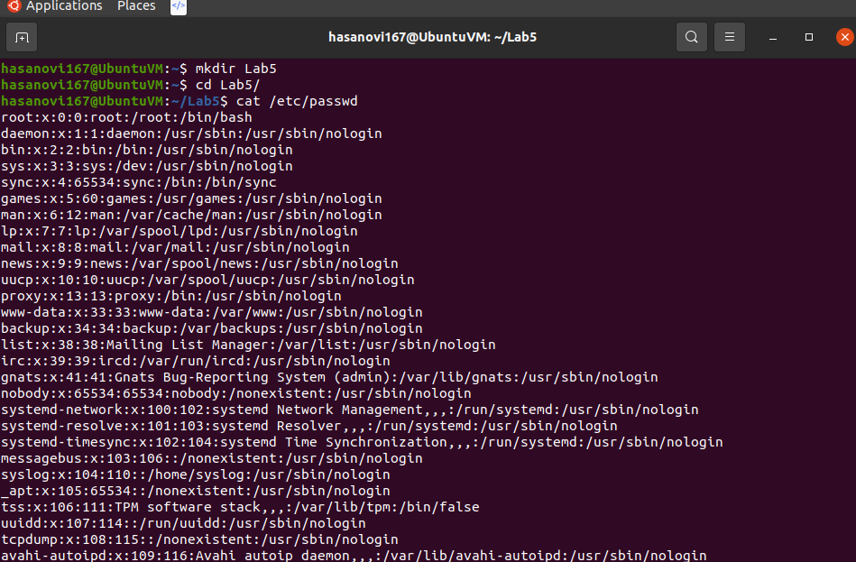
## Part2
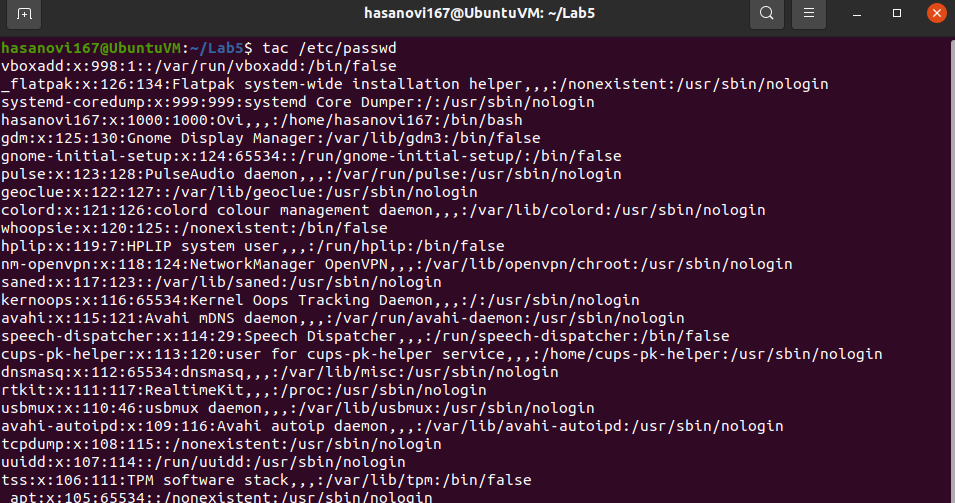
## Part3
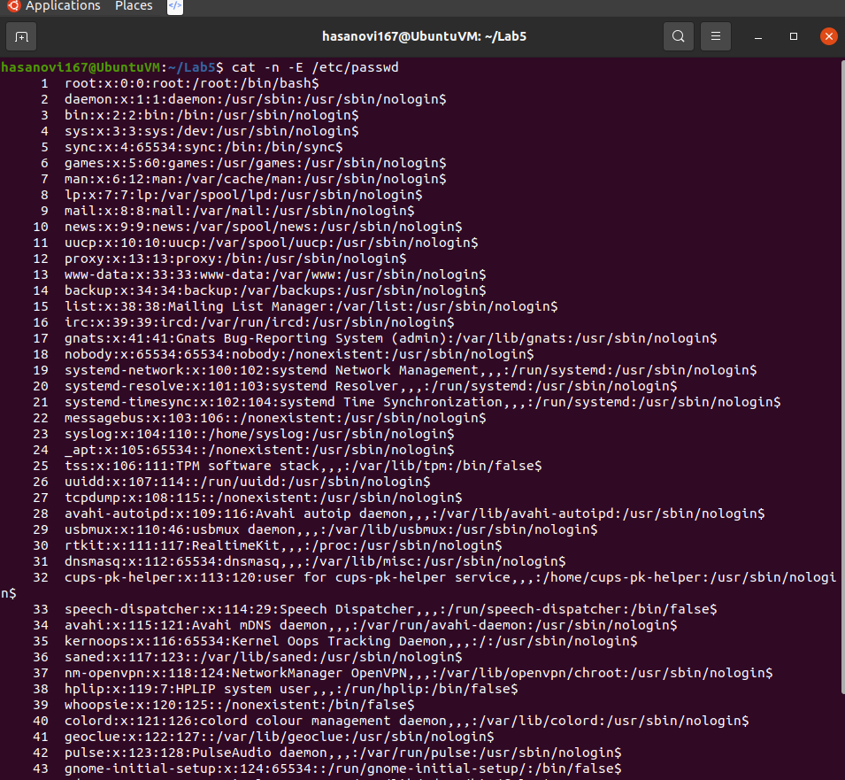
## Part4
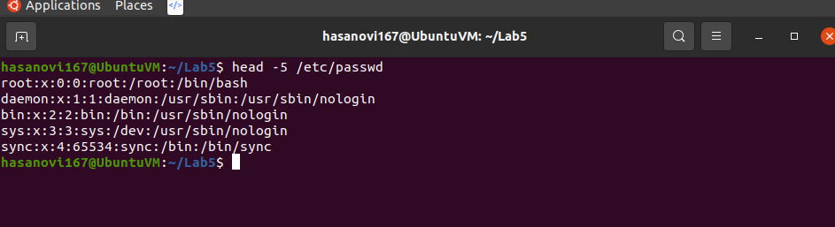
## Part5
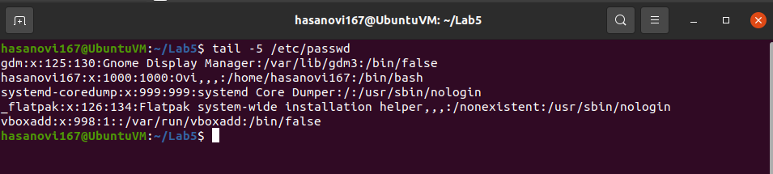
# Question 2
## Part1
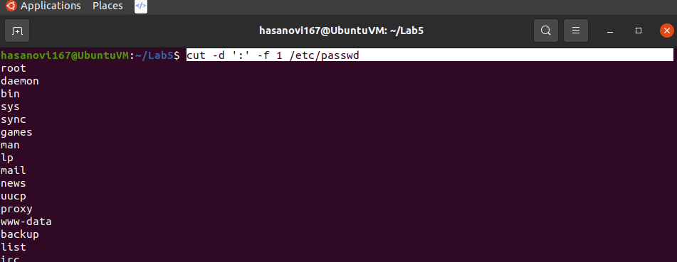
## Part2
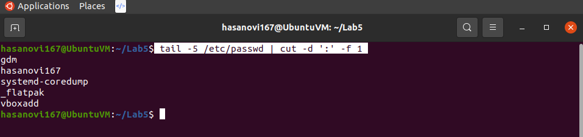
## Part3
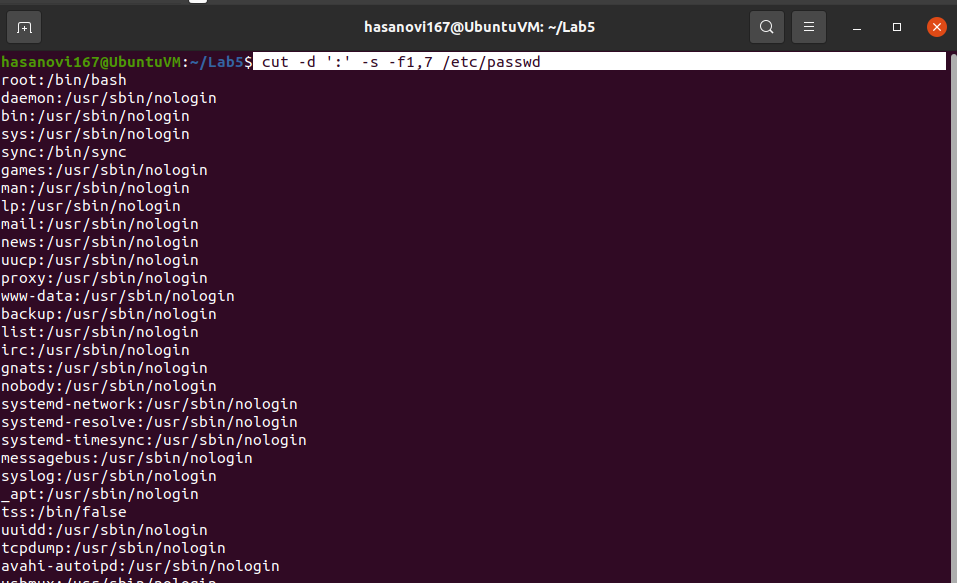
## Part4
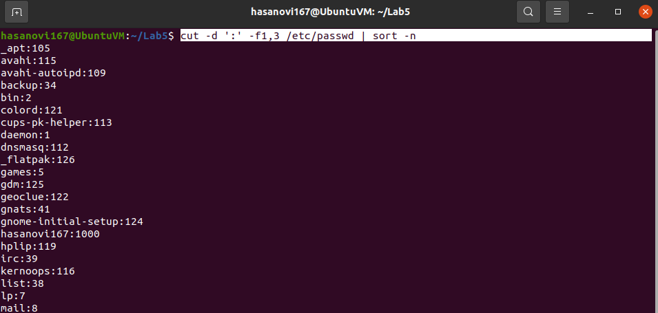
## Part5

# Question 3
## Part1
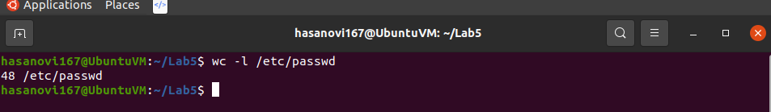
## Part2

## Part3
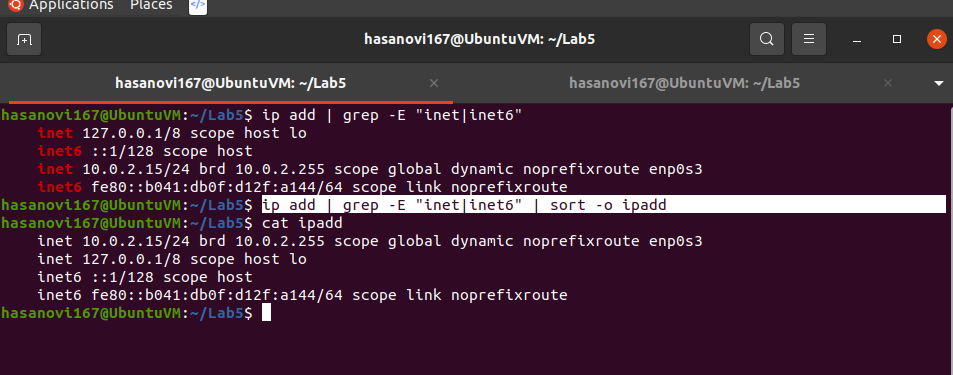
## Part4
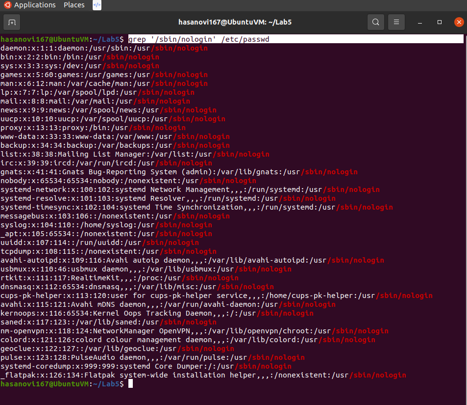
## Part5
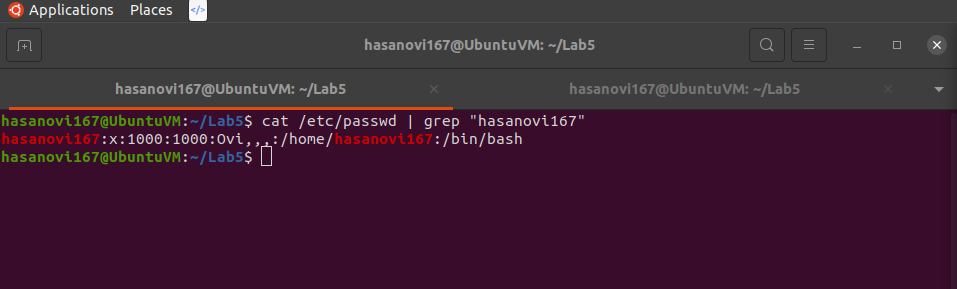
# Question 4
## Part1
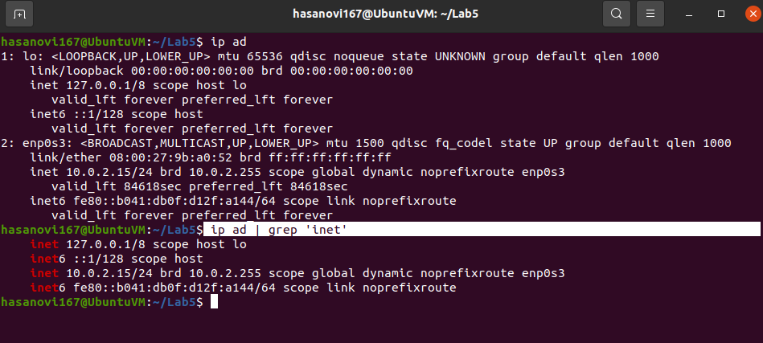
## Part2
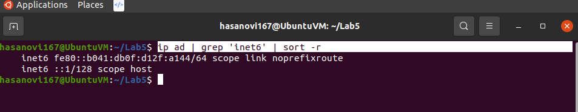
## Part3
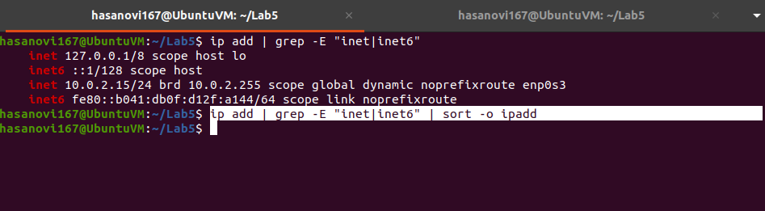
## Part4
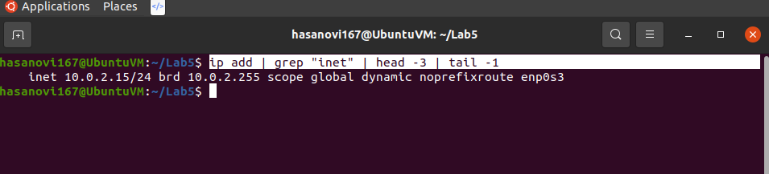
## Part5
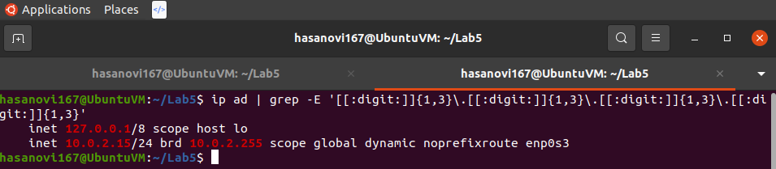
# Question 5
## Part1/2
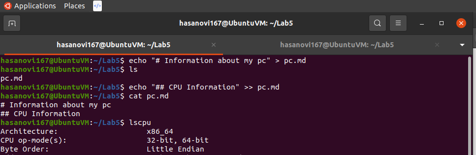
## Part3/4/5
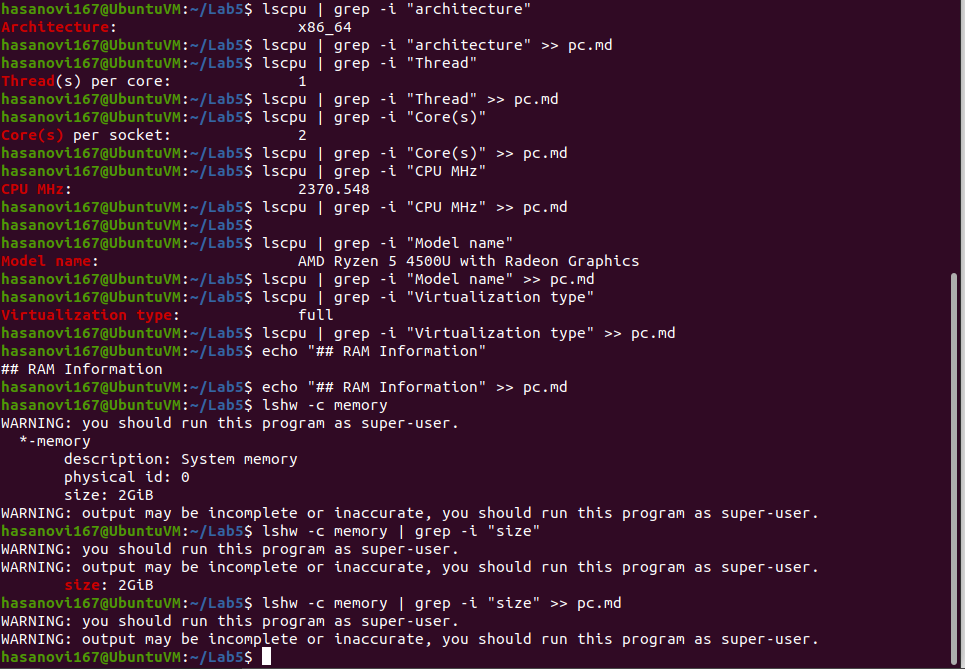
## Part6
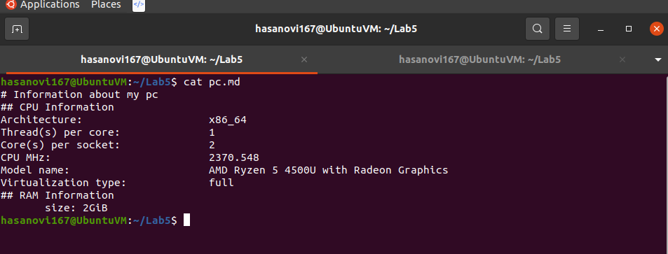